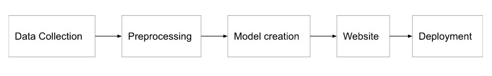
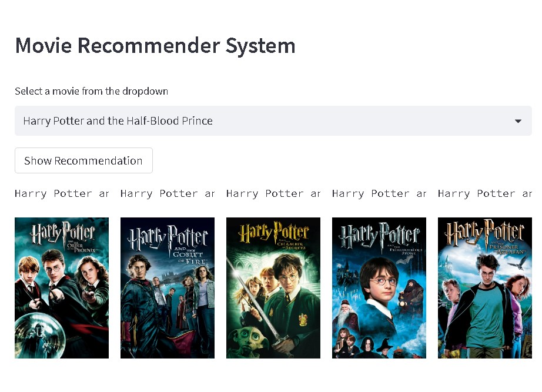
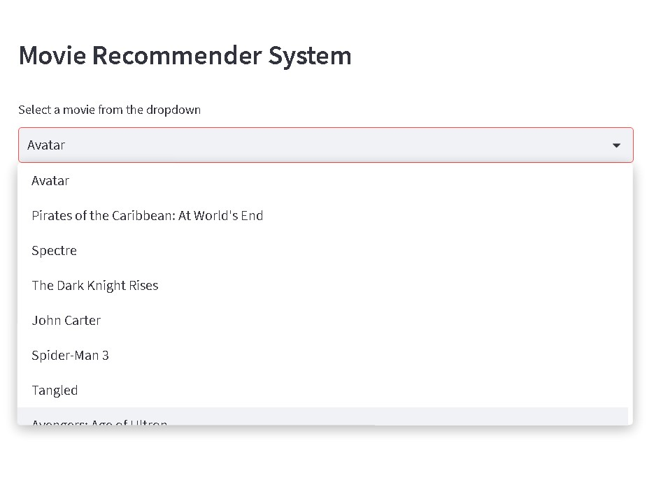

# Recommend-movies
## 1. Methodology

## 2. Description
This movie recommendation streamlit app was built using the tmdb dataset available on kaggle. After using various text processing techniques, like stopwords removal, model was built on the refined dataset. The model uses cosine similarity to calculate the distance between every movie vector and provides recommendations.

The dataset was collected from https://www.kaggle.com/datasets/tmdb/tmdb-movie-metadata?select=tmdb_5000_movies.csv
This dataset contains 2 csv files. One includes every information about the movie and the other one includes the details of cast and crew.
## 3. Input/Output

## 4. Live link
Check out the deployed version below:

https://chavvi23-recommend-movies-app-avkspq.streamlit.app/
## 5. Screenshot of the interface

